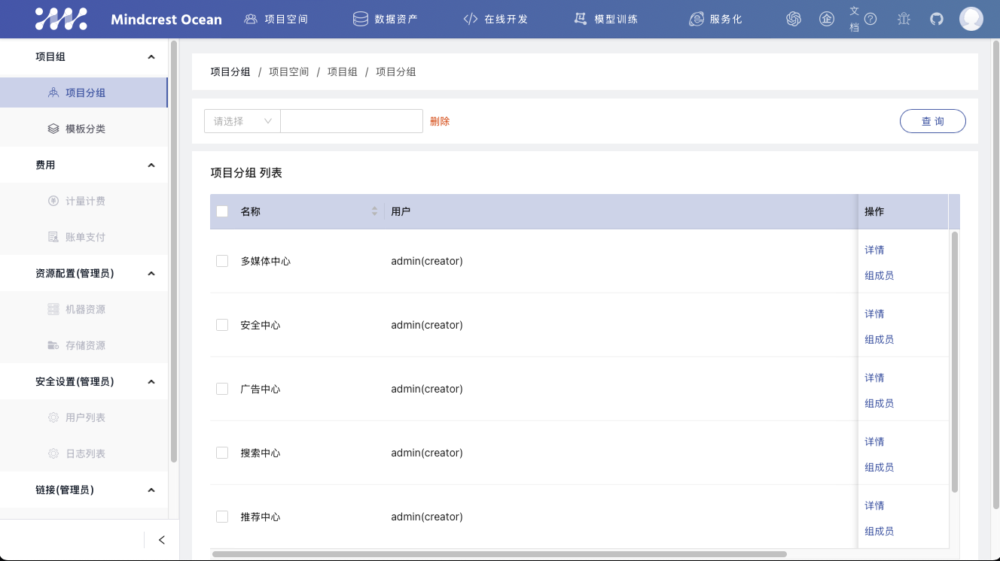
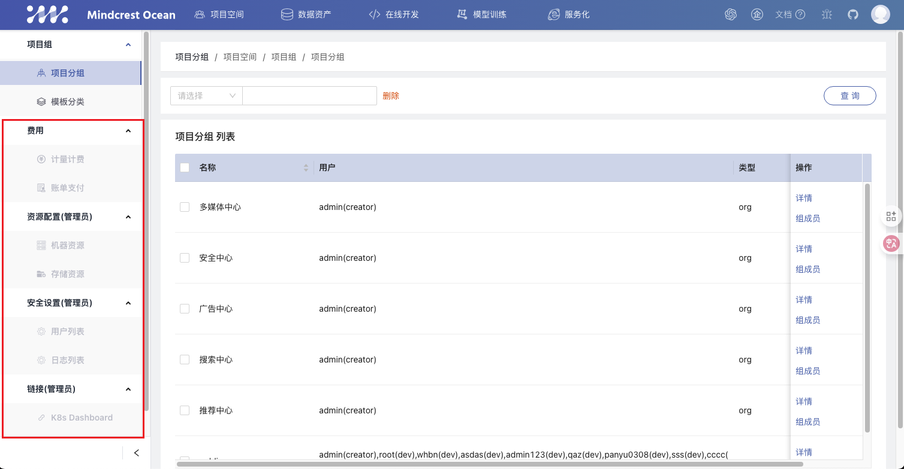
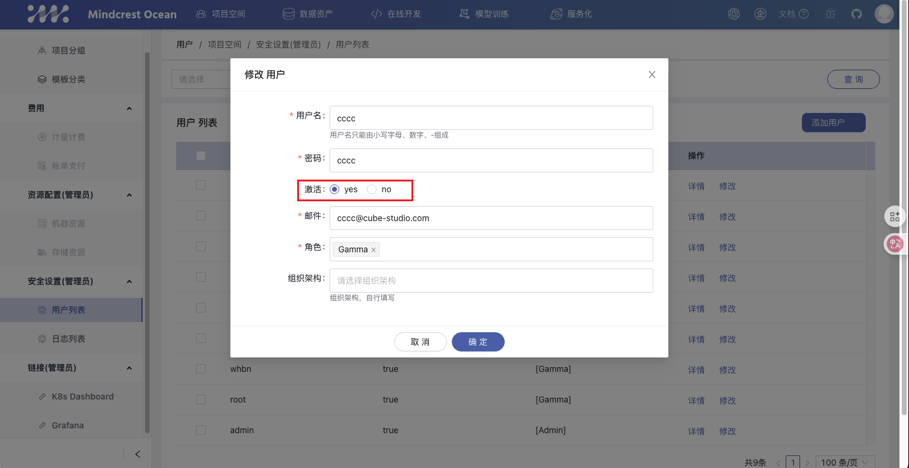
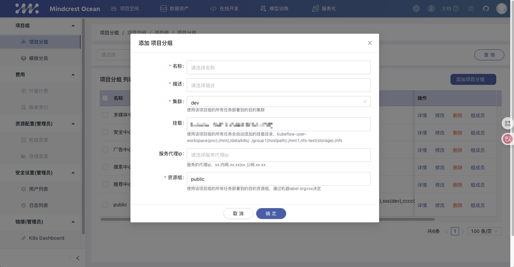

# 一、

### 注册新用户

登录即注册，使用新的用户名及密码登录进平台，即自动注册新用户，之后用这个用户名及密码登录即可。


### 界面总览

进入主界面


模型训练


项目空间



整体资源


### 用户权限

注册成功后，可以通过右上角的个人头像-用户中心，可查看新注册用户的个人信息，比如是否激活、用户角色等等。


另一种添加新用户的方法，是在项目空间-用户列表中直接添加新用户。


同样可以设定新用户的角色、用户名、密码、邮箱、是否激活等。


### 用户角色权限管理

可以通过更改用户角色来控制用户权限，比如这里用户角色只有gamma


该用户登录时，看不到机器资源、存储资源、用户列表等重要信息。



### 限制用户登录

管理员可以通过取消用户激活来限制用户登录。




### creator添加用户

路径：项目空间->项目分组->更多->组成员->添加组成员，则creator角色的组成员可以添加其他用户进组。


添加组成员时，管理员可以选择该组成员的角色，控制组成员能接触的资源和pipeline等。


### 项目组控制调度集群cluster（管理员学习）

平台支持跨集群调度。需要管理员创建集群并配置到系统配置后，可通过项目组的“集群”字段控制项目组的调度集群
    


### 项目组控制调度机器node_selector（管理员学习）

平台支持单集群中划分资源组。需要管理员配置不同机器所属的资源组后，可通过项目组的“资源组”字段控制项目组的调度机器。

项目组可以用来划分权限，同时也可以用来划分资源。一台调度机器只能划入一个资源组。如果我们单纯通过项目组来划分权限，而不划分资源，那么一个资源组就可以划入多个项目组，那么调度机器可以是不同项目组，不同机型，不同区域等划分方式，这种方式能提高我们机器的利用率，避免一个项目组不使用时，机器空闲。我们也可以用项目组划分权限的同时，划分资源，那么调度机器就只会属于一个项目组。

### 项目组控制挂载volume_mount（管理员学习）

平台支持单集群中划分挂载。可以配置项目组下成员将自有分布式存储挂载到平台，以及项目组内共享目录等功能，可通过项目组的“挂载”字段控制项目组的挂载.

- 挂载pvc，会自动挂载pvc下面的个人用户子目录。默认挂载kubeflow-user-workspace的pvc。管理员可自行创建pvc进行挂载
- 挂载hostpath，不会自动挂载个人子目录，可以用来控制多人共享同一个公共目录

pvc和hostpath可以同时存在，实现既有个人子目录，又有公共目录。

示例：
```
    {
        "volume_mount": "kubeflow-user-workspace(pvc):/mnt/;data/aidata(hostpath):/aidata"
    }
```

### 项目组控制服务service代理ip（管理员学习）

平台支持单集群中划分服务的代理ip，多用于边缘集群，或多网关情况下。可通过项目组的“服务代理ip”字段控制项目组的服务的代理ip.


# 二、模型训练开发

## 主界面选择功能

在主界面选择训练流程进入 


开始使用Jupyternotebook开发


## 在线notebook开发
进入选择的功能后选择相应的Jupyternotebook


#### 根据notebook中的提示进行开发


# 五、在线构建镜像

在线开发->镜像构建->添加docker


可配置基础镜像、目标镜像、挂载、内存等。

选择连续构建，可以在pod重启后，在断点处接着进行镜像构建。

# 六、配置/调试/定时运行pipeline

### 创建pipeline

路径：首页->新建流水线，或者 模型训练->任务流->添加任务流


### 编排pipeline


编排pipeline包括三步：
1. 将右侧模板拖拉拽至面板，并按运行步骤连接好；
2. 点击单个任务模板，设置任务参数；
 - task公共参数：参考每个配置的描述  
 - task的模板参数：参考每个模板的链接教程文档
 3. 点击pipeline名称右边的设置按钮，设置pipeline参数，比如是否定时调度、调度周期等。


# 七、nni超参搜索

可以参考[nni官网](https://github.com/microsoft/nni)的书写方式，[简体中文版链接](https://nni.readthedocs.io/zh/stable/)

## 超参空间
必须是标准的json。示例
```
{
    "batch_size": {"_type":"choice", "_value": [16, 32, 64, 128]},
    "hidden_size":{"_type":"choice","_value":[128, 256, 512, 1024]},
    "lr":{"_type":"choice","_value":[0.0001, 0.001, 0.01, 0.1]},
    "momentum":{"_type":"uniform","_value":[0, 1]}
}
```
不同超参算法支持不同的超参空间

|choice |choice(nested) |randint |uniform |quniform |loguniform |qloguniform |normal |qnormal |lognormal |qlognormal |
| :----- | :----- | :----- | :----- | :----- | :----- | :----- | :----- | :----- | :----- | :----- | 
|TPE Tuner |✓ |✓ |✓ |✓ |✓ |✓ |✓ |✓ |✓ |✓ |✓ |
|Random Search Tuner |✓ |✓ |✓ |✓ |✓ |✓ |✓ |✓ |✓ |✓ |✓ |
|Anneal Tuner |✓ |✓ |✓ |✓ |✓ |✓ |✓ |✓ |✓ |✓ |✓ |
|Evolution Tuner |✓ |✓ |✓ |✓ |✓ |✓ |✓ |✓ |✓ |✓ |✓ |
|SMAC Tuner |✓ | |✓ |✓ |✓ |✓ | | | | | |
|Batch Tuner |✓ | | | | | | | | | | |
|Grid Search Tuner |✓ | |✓ | |✓ | | | | | | |
|Hyperband Advisor |✓ | |✓ |✓ |✓ |✓ |✓ |✓ |✓ |✓ |✓ |
|Metis Tuner |✓ | |✓ |✓ |✓ | | | | | | |
|GP Tuner |✓ | |✓ |✓ |✓ |✓ |✓ | | | |
  
## 代码要求

### 参数接收
启动超参搜索，会根据用户配置的超参搜索算法，选择好超参的可选值，并将选择值传递给用户的容器。例如上面的超参定义会在用户docker运行时传递下面的参数。所以用户不需要在启动命令或参数中添加这些变量，系统会自动添加，用户只需要在自己的业务代码中接收这些参数，并根据这些参数输出值就可以了。

```
--lr=0.021593113434583065 --num-layers=5 --optimizer=ftrl
```

### 结果上报
业务方容器和代码启动接收超参进行迭代计算，通过主动上报结果来进行迭代。
示例如下，用户代码需要能接受超参可取值为输入参数，同时每次迭代通过nni.report_intermediate_result上报每次epoch的结果值，并使用nni.report_final_result上报每次实例的结果值。 
```
import os
import argparse
import logging,random,time
import nni
from nni.utils import merge_parameter

logger = logging.getLogger('mnist_AutoML')

def main(args):
    test_acc=random.randint(30,50)
    for epoch in range(1, 11):
        test_acc_epoch= random.randint(3,5)
        time.sleep(3)
        test_acc+=test_acc_epoch
        # 上报当前迭代目标值
        nni.report_intermediate_result(test_acc)
    # 上报最总目标值
    nni.report_final_result(test_acc)


def get_params():
    # 必须接收超参数为输入参数
    parser = argparse.ArgumentParser(description='PyTorch MNIST Example')
    parser.add_argument('--batch_size', type=int, default=64, help='input batch size for training (default: 64)')

    args, _ = parser.parse_known_args()
    return args


if __name__ == '__main__':
    try:
        # get parameters form tuner
        tuner_params = nni.get_next_parameter()
        params = vars(merge_parameter(get_params(), tuner_params))
        print(tuner_params,params)
        main(params)
    except Exception as exception:
        logger.exception(exception)
        raise
```
